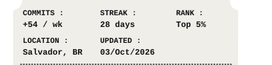
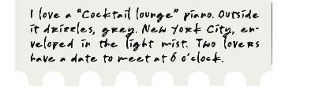

# Vintage Cinema Ticket Profile Component

<p align="center">
  <a href="https://gabrielbaiano.vercel.app/" title="Portfolio"></a><br><a href="https://gabrielbaiano.vercel.app/" title="Gabriel Gama - Front-end Developer"></a><br><a href="https://www.linkedin.com/in/gabriel-gama-6301633b2/" title="Connect on LinkedIn"></a><br><a href="https://github.com/GabrielBaiano?tab=repositories" title="View GitHub Repositories"></a><br><a href="https://gabrielbaiano.vercel.app/" title="Daily Note"></a>
</p>

<br />

High-fidelity vintage movie ticket stub graphic with seamless animated rain, transparent die-cut perforations, and a zero-gap modular sliced architecture engineered specifically for GitHub Profile READMEs (`GabrielBaiano`).

Inspired by the authentic ticket stub design of *"A Rainy Day in New York (2019)"*.

## Visual Architecture & Slicing Strategy

GitHub Markdown sanitizes JavaScript and restricts interactive inline SVG links when embedded via ``. To provide **high-resolution vector typography**, an **animated rain loop**, and **independent clickable links** on every section with **zero gap**, the ticket is sliced into 5 horizontal rows stacked using `<p align="center">` and `` with `<br>` line breaks.

```
┌────────────────────────────────────────────────────────┐
│ SLICE 1: Animated Woodcut Artwork (Rain GIF / SVG)     │ -> Links to Portfolio
│ (Top scalloped perforations + Umbrella + Skyline)      │
├────────────────────────────────────────────────────────┤
│ SLICE 2: Title & Badge Header                          │ -> Links to Portfolio
│ (Gabriel Gama / Chinese Cinema homage + Umbrellas)     │
├────────────────────────────────────────────────────────┤
│ SLICE 3: Developer Role & Social Coordinates           │ -> Links to LinkedIn
│ (Front-end Dev • TypeScript / React • Brazil)          │
├────────────────────────────────────────────────────────┤
│ SLICE 4: Activity Grid & Admission Side Notches        │ -> Links to GitHub Repos
│ (Commits/wk, Streak, Rank, Location, Updated Date)     │
├────────────────────────────────────────────────────────┤
│ SLICE 5: Handwritten Note & Bottom Perforations        │ -> Links to Daily Note / Bio
│ (Authentic cursive ink calligraphy + Bottom teeth)     │
└────────────────────────────────────────────────────────┘
```

The outer black background from the reference photo has been replaced with **100% transparency**, so the die-cut ticket stub floats naturally on both GitHub Dark (`#0d1117`) and GitHub Light (`#ffffff`) themes.

---

## Ready-to-Paste GitHub Profile Snippet

Paste this block into your profile `README.md` (e.g. `GabrielBaiano/README.md`):

```html
<p align="center">
  <a href="https://gabrielbaiano.vercel.app/" title="Portfolio"></a><br><a href="https://gabrielbaiano.vercel.app/" title="Gabriel Gama - Front-end Developer"></a><br><a href="https://www.linkedin.com/in/gabriel-gama-6301633b2/" title="Connect on LinkedIn"></a><br><a href="https://github.com/GabrielBaiano?tab=repositories" title="View GitHub Repositories"></a><br><a href="https://gabrielbaiano.vercel.app/" title="Daily Note"></a>
</p>
```

---

## Directory Structure & Generated Assets

```
ticket-profile/
├── assets/
│   ├── ticket_original.svg         # Monolithic authentic reference cinema SVG
│   ├── ticket_original.gif         # Full animated authentic cinema ticket (rain loop)
│   ├── ticket_profile.svg          # Monolithic developer profile ticket SVG
│   ├── ticket_profile.gif          # Full animated developer profile ticket GIF
│   ├── ticket_animated.svg         # Animated SVG with pure SMIL vector rain
│   └── slices/
│       ├── slice_01_art.gif        # Animated rain art slice (top scallop + woodcut)
│       ├── slice_01_art.svg        # Static/SMIL vector art slice
│       ├── slice_02_header.svg     # Title, English subtitle, 3 umbrella icons
│       ├── slice_03_social.svg     # Front-end credentials & social coordinates
│       ├── slice_04_stats.svg      # Commits grid with circular side admission notches
│       └── slice_05_note.svg       # Authentic cursive calligraphy & bottom teeth
├── scripts/
│   └── generate_ticket.py          # Master generator, compositor, and GIF compiler
├── .github/
│   └── workflows/
│       └── update-ticket.yml       # Scheduled GitHub Action for automatic metric updates
├── preview.html                    # Local interactive preview (Dark & Light theme switch)
├── profile_snippet.md              # Standalone copy-pasteable Markdown snippet
└── README.md
```

---

## Dynamic Regeneration

Run the generator script locally or via CI to regenerate the ticket with updated metrics:

```bash
python3 scripts/generate_ticket.py \
  --commits "+54 / wk" \
  --streak "28 days" \
  --rank "Top 5%" \
  --date "03/Oct/2026" \
  --location "Salvador, BR"
```
