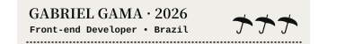
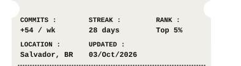
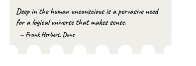

# Vintage Cinema Ticket Profile Component

<p align="center">
  <br><br><a href="https://gabrielbaiano.vercel.app/" title="Portfólio"></a><br><a href="https://www.linkedin.com/in/gabriel-gama-6301633b2/" title="Connect on LinkedIn"></a><br><br>
</p>

<br />

High-fidelity vintage movie ticket stub graphic featuring custom anime motion graphics, transparent die-cut perforations, clean minimalist stats, rotating English literary quotes, and a zero-gap modular sliced architecture engineered specifically for GitHub Profile READMEs (`GabrielBaiano`).

## Visual Architecture & Slicing Strategy

GitHub Markdown sanitizes JavaScript and restricts interactive inline SVG links when embedded via ``. To provide **high-resolution vector typography**, an **animated motion graphic**, and **independent clickable links** on selected sections with **zero gap**, the ticket is sliced into 6 horizontal rows stacked using `<p align="center">` and `` with `<br>` line breaks.

```
┌────────────────────────────────────────────────────────┐
│ SLICE 1: Anime Motion Graphics (Art GIF / SVG)         │
│ (Hypnotic spiral eyes + Floating DEPPAQ + Ink sparks)   │
├────────────────────────────────────────────────────────┤
│ SLICE 2: Title & Badge Header                          │
│ (Gabriel Gama · 2026 + Developer info + 3 Umbrellas)   │
├────────────────────────────────────────────────────────┤
│ SLICE 3: Portfólio Strip (CLICKABLE)                   │ -> https://gabrielbaiano.vercel.app/
│ (Vintage serif Portfólio + Organic pen mark + Arrow)   │
├────────────────────────────────────────────────────────┤
│ SLICE 4: LinkedIn Strip (CLICKABLE)                    │ -> https://www.linkedin.com/in/gabriel-gama-6301633b2/
│ (Clean vintage serif LinkedIn + Connect arrow)         │
├────────────────────────────────────────────────────────┤
│ SLICE 5: Clean Activity Grid & Side Admission Notches  │
│ (Commits/wk, Streak, Rank, Location, Updated Date)     │
├────────────────────────────────────────────────────────┤
│ SLICE 6: Handwritten Literary Quote (Daily Rotation)   │
│ (18 classic quotes from Dune, Frankenstein, Sisyphus,  │
│  LotR, Dante, Machado de Assis in cursive typography)  │
└────────────────────────────────────────────────────────┘
```

The outer background has **100% transparency**, allowing the die-cut ticket stub to float naturally on both GitHub Dark (`#0d1117`) and GitHub Light (`#ffffff`) themes.

---

## Daily Literary Quote Rotation

Slice 6 automatically rotates through 18 curated quotes in English from 6 world classics:
- **Dune** (*Frank Herbert*)
- **Frankenstein** (*Mary Shelley*)
- **The Myth of Sisyphus** (*Albert Camus*)
- **The Lord of the Rings** (*J.R.R. Tolkien*)
- **Inferno** (*Dante Alighieri*)
- **Machado de Assis** (*The Posthumous Memoirs of Brás Cubas, Dom Casmurro, Philosopher or Dog?*)

The quote rotates each day based on the day of the year via the automated GitHub Actions cron workflow (`0 0 * * *`).

---

## Ready-to-Paste GitHub Profile Snippet

Paste this block into your profile `README.md` (e.g. `GabrielBaiano/README.md`):

```html
<p align="center">
  <br><br><a href="https://gabrielbaiano.vercel.app/" title="Portfólio"></a><br><a href="https://www.linkedin.com/in/gabriel-gama-6301633b2/" title="Connect on LinkedIn"></a><br><br>
</p>
```

---

## Directory Structure & Generated Assets

```
.
├── assets/
│   ├── character_sketch.png        # Source manga ink sketch artwork
│   ├── ticket_paper_slice1.png     # Rendered paper background with scalloped cut
│   ├── data/                       # Vector path outlines (ticket, perimeter, etc.)
│   ├── ticket_original.svg         # Monolithic authentic reference cinema SVG
│   ├── ticket_profile.svg          # Monolithic developer profile ticket SVG
│   ├── ticket_profile.gif          # Full animated developer profile ticket GIF
│   └── slices/
│       ├── slice_01_art.gif        # Animated anime motion art slice (top scallop + ink character)
│       ├── slice_01_art.svg        # Static vector fallback slice
│       ├── slice_02_header.svg     # Title, English subtitle, 3 umbrella icons
│       ├── slice_03_portfolio.svg  # Portfólio strip with organic pen underline
│       ├── slice_04_linkedin.svg   # Clean LinkedIn strip matching Portfólio
│       ├── slice_05_stats.svg      # Clean commits grid (no divider lines)
│       └── slice_06_note.svg       # Cursive literary quote & bottom teeth
├── scripts/
│   └── generate_ticket.py          # Master generator, compositor, and GIF compiler
├── .github/
│   └── workflows/
│       └── update-ticket.yml       # Daily scheduled GitHub Action (midnight UTC)
├── preview.html                    # Local interactive preview (Dark & Light theme switch)
├── profile_snippet.md              # Standalone copy-pasteable Markdown snippet
└── README.md
```

---

## Dynamic Regeneration

Run the generator script locally or via CI to regenerate the ticket:

```bash
python3 scripts/generate_ticket.py \
  --commits "+54 / wk" \
  --streak "28 days" \
  --rank "Top 5%" \
  --location "Salvador, BR"
```

To test or override with a specific quote:

```bash
# By ID
python3 scripts/generate_ticket.py --quote-id dune-fear

# By index (0..17)
python3 scripts/generate_ticket.py --quote-index 2

# Force regenerate GIF animations
python3 scripts/generate_ticket.py --force-gif
```
